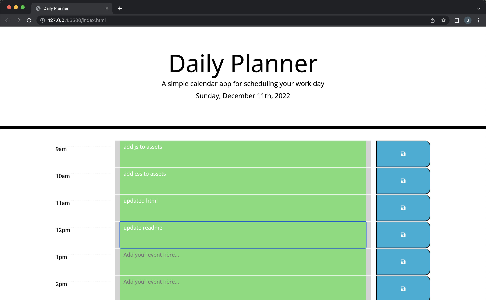

# Daily Planner

## Overview

A simple calendar application that allows a user to save events for each hour of the day. The app runs in the browser and features dynamically updated HTML and CSS powered by jQuery.

Uses [Moment.js](https://momentjs.com/) library to work with date and time.

## User Story

```md
AS AN employee with a busy schedule
I WANT to add important events to a daily planner
SO THAT I can manage my time effectively
```

## Features

The app:

- Displays the current day at the top of the calender when a user opens the planner.

- Presents timeblocks for standard business hours when the user scrolls down.

- Color-codes each timeblock based on past, present, and future when the timeblock is viewed.

- Allows a user to enter an event when they click a timeblock

- Saves the event in local storage when the save button is clicked in that timeblock.

- Persists events between refreshes of a page

## Screenshot

The following screenshot demonstrates the application functionality:



### Deployed:

- The URL of the deployed application:

https://stevelab1.github.io/Daily-Planner/

- The URL of the GitHub repository:

https://github.com/stevelab1/Daily-Planner

### Credits:

Trilogy, edX, Bootstrap, jQuery, Moment
